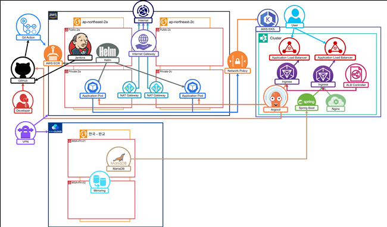
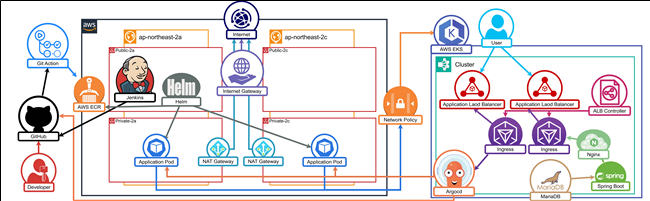

# 2차 프로젝트: Spring Boot 기반 웹 애플리케이션의 클라우드 배포 및 MSA 전환

Spring Boot를 활용한 3-tier 웹 애플리케이션을 AWS EKS에 배포하고, Monolithic에서 MSA로 전환하는 프로젝트입니다.

## 프로젝트 개요
- **목표:** Spring Boot 웹 애플리케이션의 클라우드 배포 및 MSA 아키텍처 전환
- **주요 기술:** Spring Boot, AWS EKS, Kubernetes, Docker, GitHub Actions, Jenkins, ArgoCD, Prometheus, Grafana, Helm
- **기간:** 2025.05.03 ~ 2025.06.01

## 팀 구성 및 역할
- **PM 최호준:** 프로젝트 총괄, CI/CD 구성
- **PL 홍명기:** 기술스택 담당, 멀티 클라우드 및 클러스터 구성
- **서기 이성현:** 프로젝트 기획 문서화, Monitoring 및 Alert 구성
- **발표자 박선우:** Spring Boot 웹 어플리케이션 구성

## 전체 아키텍처

### MSA 아키텍처 구성도

### Monolithic 아키텍처 구성도

## Monolithic 아키텍처 구현
### 목표
- Spring Boot 기반 3-tier 웹 애플리케이션을 AWS EKS에 배포

### 주요 단계
1. Spring Boot 웹 애플리케이션 개발 (Frontend, Backend, Database)
2. Docker 이미지 빌드 및 ECR 푸시 자동화
3. AWS EKS 클러스터 구성 및 배포
4. ALB Controller와 Ingress Resource를 통한 외부 접근 구성

### AWS 인프라 구성
- **멀티 AZ 구성:** 2개의 가용영역(AZ)에 고가용성 인프라 구축
- **Public Subnet:** 각 AZ에 1개씩, 총 2개의 Public Subnet으로 ALB 고가용성 확보
- **Private Subnet:** 각 AZ에 1개씩, 총 2개의 Private Subnet으로 워커노드 고가용성 확보
- **Application Load Balancer:** 멀티 AZ 구성으로 단일 장애점 제거
- **EKS 클러스터:** Private Subnet에 배치된 워커노드로 안전한 애플리케이션 실행

### 성과
- 완전 자동화된 CI/CD 파이프라인 구축
- Kubernetes 기반의 안정적인 애플리케이션 배포
- 멀티 AZ 구성으로 Application Load Balancer의 고가용성 확보
- Private Subnet 기반 워커노드로 보안성과 안정성 동시 확보

---

## MSA 아키텍처 전환
### 목표
- Monolithic 구조를 MSA로 전환하여 서비스 분리 및 독립성 확보

### 주요 단계
1. Backend 서비스 분리 (사용자 관리, 게시판 API)
2. AWS EKS에서 Frontend, Backend 서비스 배포
3. NHN Cloud RDS for MariaDB 연결
4. Site to Site VPN을 통한 멀티 클라우드 구성

### 성과
- 서비스별 독립적인 배포 및 확장 가능
- 멀티 클라우드 환경에서의 안정적인 데이터 관리
- 마이크로서비스 아키텍처의 실무 적용

---

## CI/CD 파이프라인 구축
### 목표
- GitOps 기반의 완전 자동화된 배포 파이프라인 구축

### 주요 단계
1. GitHub Actions로 소스코드 빌드 및 ECR 푸시
2. Jenkins가 ECR 이미지 변경 감지
3. Helm Chart values.yaml 자동 업데이트
4. ArgoCD가 Git 변경사항 감지하여 Rolling Update 수행

### 성과
- 코드 변경부터 배포까지 완전 자동화
- GitOps 기반의 안전하고 추적 가능한 배포
- 무중단 배포(Rolling Update) 구현

---

## 모니터링 및 알림 시스템
### 목표
- 실시간 모니터링 및 자동 알림 시스템 구축

### 주요 단계
1. Prometheus를 통한 메트릭 수집
2. Grafana 대시보드 구성
3. Grafana Alert 기능을 통한 Discord 알림 설정
4. Pod 상태 변경 시 자동 알림 구성

### 성과
- 실시간 시스템 모니터링 및 성능 추적
- 자동화된 알림 시스템으로 빠른 대응 가능
- 운영 안정성 및 신뢰성 향상

---

## 기술 스택 상세

### 개발 환경
- **Spring Boot:** 웹 애플리케이션 개발 프레임워크
- **Docker:** 컨테이너화 및 이미지 빌드
- **Helm:** Kubernetes 패키지 관리

### 클라우드 인프라
- **AWS EKS:** Kubernetes 클러스터 관리 (멀티 AZ 구성)
- **AWS ECR:** 컨테이너 이미지 저장소
- **AWS ALB:** Application Load Balancer (고가용성 구성)
- **AWS VPC:** Public/Private Subnet 구성 (2개 AZ)
- **NHN Cloud RDS:** Managed MariaDB 서비스

### CI/CD 도구
- **GitHub Actions:** 소스코드 빌드 및 이미지 푸시
- **Jenkins:** ECR 이미지 변경 감지 및 Helm Chart 업데이트
- **ArgoCD:** GitOps 기반 배포 자동화

### 모니터링 및 알림
- **Prometheus:** 메트릭 수집 및 저장
- **Grafana:** 대시보드 및 알림 관리
- **Discord:** 알림 메시지 전송

### 네트워크
- **Site to Site VPN:** 멀티 클라우드 연결
- **Ingress Controller:** Kubernetes 외부 접근 관리

---

## 프로젝트 성과

### 기술적 성과
- **완전 자동화된 CI/CD 파이프라인:** 코드 변경부터 배포까지 자동화
- **MSA 아키텍처 전환:** 서비스 분리 및 독립성 확보
- **멀티 클라우드 구성:** AWS와 NHN Cloud 연동
- **실시간 모니터링:** Prometheus + Grafana 기반 모니터링 시스템

### 운영적 성과
- **무중단 배포:** Rolling Update를 통한 서비스 중단 최소화
- **자동 알림 시스템:** Discord를 통한 실시간 알림
- **GitOps 기반 배포:** 안전하고 추적 가능한 배포 프로세스
- **고가용성 확보:** 멀티 AZ 구성의 ALB와 Kubernetes를 통한 안정적인 서비스 제공
- **장애 대응력:** 단일 AZ 장애 시에도 서비스 연속성 보장

---

> [🏠 Home으로 돌아가기](index.md) 