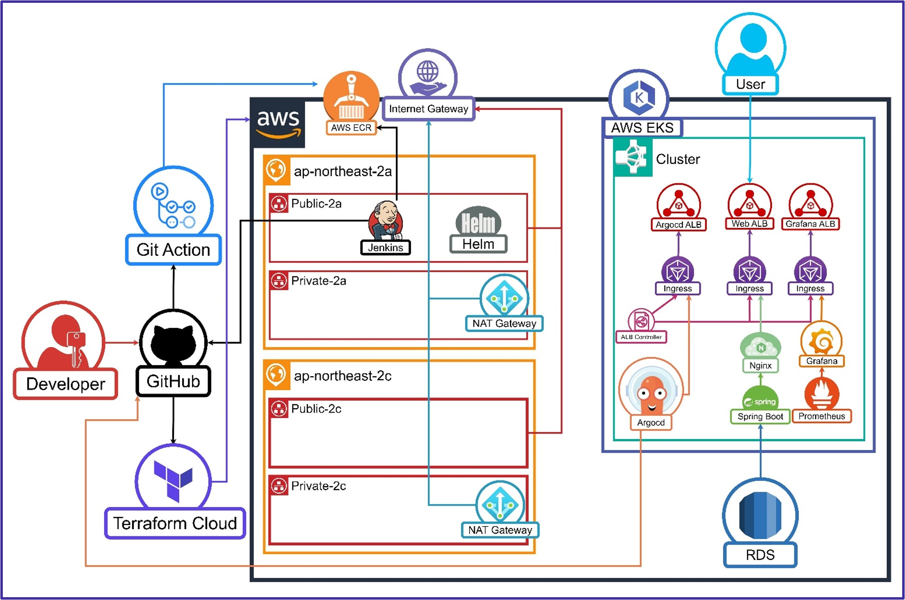

# 3차 프로젝트: Terraform을 활용한 IaC와 시나리오 기반 클라우드 DR 환경 구성

Terraform을 활용하여 Infrastructure as Code(IaC)를 구현하고, 시나리오 기반의 클라우드 재해복구(DR) 환경을 구성한 프로젝트입니다.

## 프로젝트 개요
- **목표:** Terraform을 활용한 IaC 구현 및 시나리오 기반 클라우드 DR 환경 구성
- **주요 기술:** Terraform, AWS, Kubernetes, Helm, ArgoCD, Prometheus, Grafana, Jenkins
- **기간:** 2025.06.02 ~ 2025.07.01

## 팀 구성 및 역할
- **PM 최호준:** 프로젝트 총괄, CI/CD 구성, REPO 관리
- **PL 홍명기:** 기술스택 담당, Terraform Cloud
- **발표자 박선우:** 발표, 백업 구현, 발표 자료 작성
- **서기 이성현:** 문서 작성, Terraform Local, RDS

## 전체 아키텍처

## 사용한 주요 스택

### 인프라 자동화
- **Terraform:** Infrastructure as Code 구현
- **Terraform Cloud:** 클라우드 기반 Terraform 관리
- **Terraform Local:** 로컬 환경에서의 Terraform 실행

### 클라우드 인프라
- **AWS EKS:** Kubernetes 클러스터 관리
- **AWS ECR:** 컨테이너 이미지 저장소
- **AWS RDS:** Managed MariaDB 서비스
- **AWS Backup:** 자동화된 백업 서비스
- **AWS S3:** 백업 데이터 저장소

### CI/CD 도구
- **GitHub Actions:** 소스코드 빌드 및 이미지 푸시
- **Jenkins:** 파이프라인 구축 및 자동화 작업
- **ArgoCD:** GitOps 배포 자동화 도구
- **Helm:** 리소스 정의 및 템플릿화

### 모니터링 및 백업
- **Prometheus:** 메트릭 수집 및 저장
- **Grafana:** 대시보드 및 알림 관리
- **AWS Backup:** EC2, RDS, ECR 백업 자동화

## 프로젝트 주요 내용

본 프로젝트는 Terraform을 활용하여 Infrastructure as Code를 구현하고, 시나리오 기반의 클라우드 재해복구 환경을 구축하는 것을 목표로 하였습니다.

### 전체 자동화 흐름
- **Terraform Local + Cloud:** 로컬과 클라우드 환경에서의 Terraform 실행
- **MSA 인프라 구성:** Terraform Cloud를 통한 마이크로서비스 아키텍처 구축
- **리소스 백업 관리:** AWS Backup을 활용한 다양한 리소스 백업 자동화

### 주요 챕터별 구현
- **Terraform 코드 구성:** 인프라와 애플리케이션 분리 구성
- **Workspace 생성:** Terraform-Infra, Terraform-App 워크스페이스 구성
- **CI/CD 파이프라인:** GitOps 기반 자동화 배포 시스템
- **백업 및 복구:** EC2, RDS, ECR 이미지 백업 자동화

### 협업 및 문서화
- 각 파트별 Terraform 코드를 개발하고, 실습 결과를 문서화
- 지속적인 피드백 및 개선을 통해 프로젝트 완성도 향상

---

## Terraform 코드 구성

### 목표
- 용도별로 분리된 Terraform 코드 구조 설계 및 구현

### 주요 단계
1. Terraform-Infra: 인프라 리소스 자동 생성
2. Terraform-App: 애플리케이션 배포 자동화
3. Helm Chart: 애플리케이션 패키징 및 관리

### 성과
- 체계적인 Terraform 코드 구조로 유지보수성 향상
- 인프라와 애플리케이션 분리로 관리 효율성 증대
- 재사용 가능한 모듈화된 코드 구조 구축

---

## Terraform Cloud 환경 구성

### 목표
- Terraform Cloud를 활용한 중앙화된 인프라 관리

### 주요 단계
1. Terraform-Infra, Terraform-App 워크스페이스 생성
2. Auto-apply 설정 및 Run Trigger 구성
3. 환경 변수 및 민감 정보 관리

### 성과
- 중앙화된 Terraform 상태 관리
- 팀 협업을 위한 워크스페이스 기반 작업 환경
- 자동화된 인프라 배포 및 관리

---

## AWS 인프라 자동 생성

### 목표
- Terraform을 통한 모든 AWS 리소스 자동 생성

### 주요 단계
1. VPC, Subnet, IGW, NGW 자동 생성
2. EC2, SG, Route, RDS 자동 구성
3. ECR, Node Group, EKS 클러스터 자동 배포

### 성과
- 완전 자동화된 AWS 인프라 구축
- 코드 기반 인프라 관리로 재현성 확보
- 문서화, 공유 및 협업 용이성 향상

---

## CI/CD 파이프라인 구축

### 목표
- GitOps 기반의 완전 자동화된 배포 파이프라인 구축

### 주요 단계
1. GitHub Actions로 소스코드 빌드 및 ECR 푸시
2. Jenkins가 ECR 이미지 변경 감지
3. ArgoCD가 Git 변경사항 감지하여 EKS 배포

### 성과
- 코드 변경부터 배포까지 완전 자동화
- GitOps 기반의 안전하고 추적 가능한 배포
- Jenkins와 ArgoCD를 통한 효율적인 CI/CD 구축

---

## 백업 및 재해복구 시스템

### 목표
- 다양한 AWS 리소스의 자동화된 백업 및 복구 시스템 구축

### 주요 단계
1. AWS Backup을 통한 EC2 인스턴스 백업
2. RDS 스냅샷 생성 및 복구
3. ECR 이미지를 S3에 tar 파일로 백업

### 성과
- 자동화된 백업 시스템으로 데이터 보호
- 시나리오 기반 재해복구 환경 구축
- 서비스 안정성과 신뢰성 보장

---

## 기술 스택 상세

### 인프라 자동화
- **Terraform:** Infrastructure as Code 구현
- **Terraform Cloud:** 클라우드 기반 Terraform 관리
- **Terraform Local:** 로컬 환경에서의 Terraform 실행

### 클라우드 인프라
- **AWS EKS:** Kubernetes 클러스터 관리
- **AWS ECR:** 컨테이너 이미지 저장소
- **AWS RDS:** Managed MariaDB 서비스
- **AWS Backup:** 자동화된 백업 서비스
- **AWS S3:** 백업 데이터 저장소

### CI/CD 도구
- **GitHub Actions:** 소스코드 빌드 및 이미지 푸시
- **Jenkins:** 파이프라인 구축 및 자동화 작업
- **ArgoCD:** GitOps 배포 자동화 도구
- **Helm:** 리소스 정의 및 템플릿화

### 모니터링 및 백업
- **Prometheus:** 메트릭 수집 및 저장
- **Grafana:** 대시보드 및 알림 관리
- **AWS Backup:** EC2, RDS, ECR 백업 자동화

---

## 프로젝트 성과

### 기술적 성과
- **완전 자동화된 인프라 관리:** Terraform을 통한 모든 AWS 리소스 자동 생성
- **GitOps 기반 배포:** Git을 Single Source of Truth로 활용한 배포 자동화
- **시나리오 기반 DR 환경:** 다양한 리소스의 개별 백업으로 서비스 안정성 확보
- **중앙화된 상태 관리:** Terraform Cloud를 통한 팀 협업 환경 구축

### 운영적 성과
- **문서화 및 재현성:** 코드 기반 인프라로 문서화, 재현성, 공유 및 협업 용이
- **자동화된 백업 시스템:** 다양한 리소스를 개별적으로 백업하여 서비스 안정성 보장
- **효율적인 리소스 관리:** AWS Backup을 통한 체계적인 백업 및 복구 관리
- **팀 협업 환경:** Terraform Cloud 워크스페이스를 통한 효율적인 팀 작업

---

> [🏠 Home으로 돌아가기](index.md) 